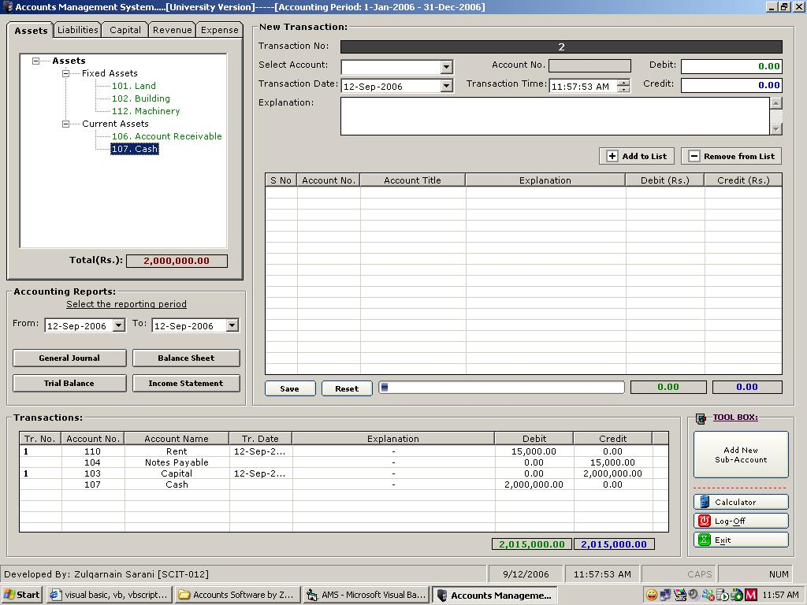



## Accounts Management System

### Description

This software handles 4 main parts of Accounting Cycle i.e

General Journal/Ledger

Balance Sheet,

Trial Balance,

Income Statement,

(with Transactions)

This is my first posting on PSC.

I had to make a project on Accounts Management. I tried to find out examples over the internet but all the efforts were in vain. I couldn't find one (neither on PSC or A1VbCode or FrreeVbCode etc) which fulfil my needs.

I decided to start on my own and eventually with in 15 hours I was able to develop this software.

This code will teach about basic Accounting Terminologies, Accounitng calculations and Dr/Cr

This code will also teach to use Data-Reports without Data Environment.
 
### More Info
 
Just enter transactions making sure that Debit is equal to Credit and view Accounting reports on single click.

Accounting Software basically deals with reports, so mainly reports are the outputs.

             |
---                |---
**Submitted On**   |2006-09-10 11:33:58
**By**             |[Zulqarnain](https://github.com/Planet-Source-Code/PSCIndex/blob/master/ByAuthor/zulqarnain.md)
**Level**          |Intermediate
**User Rating**    |4.8 (271 globes from 57 users)
**Compatibility**  |VB 3\.0, VB 4\.0 \(16\-bit\), VB 4\.0 \(32\-bit\), VB 5\.0, VB 6\.0, VBA MS Access
**Category**       |[Complete Applications](https://github.com/Planet-Source-Code/PSCIndex/blob/master/ByCategory/complete-applications__1-27.md)
**World**          |[Visual Basic](https://github.com/Planet-Source-Code/PSCIndex/blob/master/ByWorld/visual-basic.md)
**Archive File**   |[Accounts\_M2019269112006\.zip](https://github.com/Planet-Source-Code/zulqarnain-accounts-management-system__1-66532/archive/master.zip)

